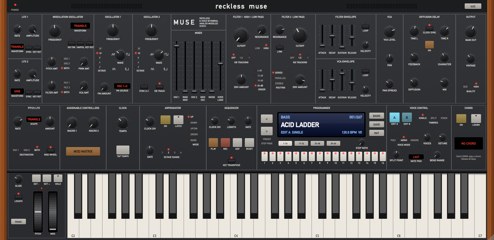

# RecklessMuse

**Synthé polyphonique 8 voix bitimbral à modélisation analogique — VST3 / AU / Standalone pour macOS.**
Inspiré de l'architecture du Moog Muse et du son des synthés Moog classiques (Minimoog Model D, Taurus, Memorymoog, Polymoog).



> RecklessMuse est un projet indépendant et open source. Il n'est ni affilié, ni approuvé, ni sponsorisé par Moog Music Inc.
> « Moog » et « Muse » sont des marques de leurs propriétaires respectifs ; elles ne sont citées ici qu'à titre de référence d'inspiration.

## Téléchargement

Dernière version : onglet **[Releases](https://github.com/RecklessBoise/RecklessMuse/releases)** → `RecklessMuse-macOS.zip` (binaire universel Apple Silicon + Intel, macOS 11+).

1. Dézippe l'archive.
2. Dans le Terminal : `cd ~/Downloads/RecklessMuse && ./install.sh`
3. Relance le scan des plug-ins dans ton DAW (Logic, Ableton Live, Bitwig, Reaper, Studio One…).

Les binaires ne sont pas notarisés par Apple (pas de compte développeur payant) : le script retire la quarantaine et re-signe localement.

## Architecture sonore

Chaque timbre (A et B) possède 8 voix ; les deux timbres peuvent être joués seuls, en **Split** (point de partage réglable) ou en **Stack**.

| Section | Détails |
|---|---|
| **Oscillateurs 1 & 2** | Forme d'onde continue Triangle → Dent de scie → Carré → Pulse étroite, anti-aliasing polyBLEP/polyBLAMP, octaves 32'–2', ±7 demi-tons, hard sync 2→1, suivi clavier désactivable |
| **Oscillateur de modulation** | Par voix, de 0,02 Hz à 2 kHz (taux audio), 7 formes, suivi clavier, unipolaire, key reset — module pitch, filtres, PWM, VCA, ou sert de 3ᵉ oscillateur |
| **FM** | OSC 1→2, MOD→1, MOD→2, MOD→1+2 |
| **Mixer** | OSC 1, Ring Mod, OSC 2, Mod Osc, Bruit, **Overload** (saturation asymétrique du mixer) |
| **Filtres** | 2 filtres à échelle Moog (ladder 4 pôles, ZDF non linéaire, auto-oscillation), Filtre 1 LP/HP, pente 6/12/18/24 dB, routage série / parallèle / stéréo, Link, suivi clavier Off/½/1 |
| **Enveloppes** | Filtre + VCA, ADSR à courbes RC analogiques, boucle, sensibilité à la vélocité |
| **LFO** | LFO 1 & 2 (7 formes, sync tempo, key reset) + Pitch LFO dédié au vibrato (molette) |
| **Matrice de modulation** | 8 slots par timbre : source × « via » → destination, montant bipolaire |
| **Voix** | Poly / Mono / Unison (2–8 voix), detune, glide (legato ou non), priorité de note (dernière / basse / haute), bend range |
| **Diffusion Delay** | Delay stéréo L/R (libre ou synchronisé), feedback diffusé par allpass, Character (assombrissement + wow), Mix |
| **Performance** | Arpégiateur (Up/Down/Up-Down/Order/Random, 1–4 octaves, latch), séquenceur 64 pas (rec, adv, reset, transposition au clavier), Chord memory (learn), 2 macros, tap tempo, sync à l'hôte |
| **Caractère analogique** | Bouton **Vintage** : dérive lente de l'accord par voix, tolérances de composants (accord et cutoff différents par voix), oscillateurs libres, bruit de fond analogique |
| **Qualité** | Rendu des voix suréchantillonné 2× (filtre half-band polyphase IIR), mode Eco 1× |

### Le son « Moog »

Le cœur du son est le filtre à échelle : quatre étages à topologie préservée (zero-delay feedback), une rétroaction résolue puis saturée en tanh comme la paire différentielle d'entrée du circuit réel, une légère saturation par étage, et la perte de grave caractéristique quand la résonance monte (compensée à moitié seulement, comme sur l'original). À résonance maximale, le filtre auto-oscille proprement et suit le clavier. L'**Overload** du mixer pousse les oscillateurs dans une saturation asymétrique avant le filtre : c'est la recette du gros son Minimoog.

## Interface

* Redimensionnable de **50 % à 200 %** : poignée en bas à droite, ou bouton **SIZE** (en haut à droite). La taille est mémorisée avec le projet.
* **EDIT A / EDIT B** (Voice Control) : choisit le timbre affiché par toute la face avant.
* **MOD MATRIX** (Assignable Controllers) : ouvre la matrice de modulation du timbre édité.
* Programmer : `<` `>` pour naviguer dans les presets, **BANK** pour changer de catégorie, **SAVE** pour sauver un preset utilisateur (dans `~/Music/RecklessMuse/Presets`), **INIT** pour repartir de zéro.
* **Favoris** : **♥ LIKE** ajoute / retire le preset courant de la banque **Favorites**. Cette banque apparaît en premier dans le cycle **BANK** ; une fois dedans, `<` `>` ne parcourent que tes presets likés. Clic sur l'écran = menu de tous les presets, avec la banque Favorites en tête (les presets likés y sont marqués ♥). Les favoris sont enregistrés dans `~/Music/RecklessMuse/Favorites.xml` et partagés par tous tes projets et toutes les instances.
* Séquenceur : **PLAY** arme le séquenceur, qui joue **tant qu'une touche est tenue** (la touche transpose : jouer la note du pas 1 donne la hauteur d'origine). **LATCH** (arpégiateur) ou **HOLD** le font tourner seul ; l'arrêt du transport du DAW l'arrête toujours.
  Clic sur un pas = sélection, second clic = active / silence ; **STEP NOTE** règle la note du pas sélectionné ; **REC** enregistre depuis le clavier.
* Arpégiateur : joue tant que les notes sont tenues ; **LATCH** ou **HOLD** pour le garder actif après relâchement.
* Double-clic sur un potentiomètre = valeur par défaut ; Shift + glisser = réglage fin ; clic droit sur un sélecteur = menu.

## Presets

**267 presets d'usine** répartis en 10 catégories : Bass, Lead, Pad, Keys, Brass, Strings, Pluck, Sequence, FX, Split.
Liste complète : [docs/PRESETS.md](docs/PRESETS.md). Ils sont générés par [`tools/generate_presets.py`](tools/generate_presets.py) — modifie le script et relance-le pour créer les tiens en masse.

## Compiler depuis les sources

Prérequis : macOS 11+, CMake ≥ 3.22, Xcode ou les Command Line Tools.

```bash
git clone --recursive https://github.com/RecklessBoise/RecklessMuse.git
cd RecklessMuse
cmake -S . -B build -DCMAKE_BUILD_TYPE=Release
cmake --build build -j
./build/RecklessMuseTests_artefacts/Release/RecklessMuseTests   # tests + rendu de tous les presets
./scripts/install.sh build                                       # installe VST3 + AU
```

Binaire universel : ajoute `-DCMAKE_OSX_ARCHITECTURES="arm64;x86_64"`.

> Certaines versions récentes des Command Line Tools ne trouvent plus les en-têtes C++ standard (`'algorithm' file not found`).
> Contournement : `export CXXFLAGS="-stdlib++-isystem $(xcrun --show-sdk-path)/usr/include/c++/v1"` avant de configurer.

### Organisation du code

```
Source/
  Params.*              Paramètres (254, automatisables)
  dsp/                  Oscillateurs, filtre ladder, enveloppes, delay
  engine/               Voix, timbres, moteur, arpégiateur / séquenceur / accords
  presets/              Gestion des presets (usine + utilisateur)
  ui/                   Look & feel, contrôles, écran, panneau principal, matrice
tools/generate_presets.py   Générateur de la banque d'usine
tests/                  Tests DSP + rendu de chaque preset + capture de l'interface
```

La CI GitHub Actions compile en binaire universel, lance les tests, valide l'AU avec `auval` et le VST3 avec `pluginval`, puis publie une Release à chaque tag `v*`.

## Licence

[GNU AGPLv3](LICENSE) — le projet utilise le framework [JUCE](https://juce.com) sous sa licence open source AGPLv3. Le SDK VST3 est sous licence MIT (Steinberg).
